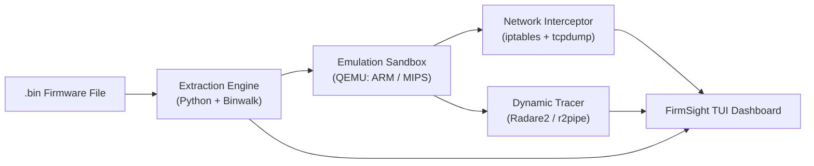

<div align="center">

# 🔍 FirmSight

### IoT Firmware Emulation & Dynamic Analysis Sandbox

*Safely emulate and analyze suspicious IoT firmware — no physical hardware required.*

[](https://www.python.org/)
[](https://textual.textualize.io/)
[]()
[]()

</div>

---

## Table of Contents

- [Overview](#overview)
- [Architecture](#architecture)
- [Features](#features)
- [Quick Start](#quick-start)
- [Development Log — Week 1](#development-log--week-1)
- [Roadmap](#roadmap)
- [Project Context](#project-context)

---

## Overview

Billions of IoT devices — routers, cameras, smart locks — run custom Linux firmware that's rarely secure. Manufacturers often leave hardcoded backdoors or hidden services baked into the code, and this kind of firmware is difficult to analyze safely: reading the code alone misses malicious behavior that only appears at runtime, while running it dynamically has traditionally meant desoldering the flash chip off real hardware.

**FirmSight solves this by emulating firmware entirely in software.** Point it at a `.bin` firmware file and it will:

1. **Extract** the hidden Linux filesystem from the raw binary
2. **Emulate** it under QEMU — booting foreign ARM/MIPS firmware transparently on a normal x86 machine
3. **Isolate & capture** all outbound network activity in an air-gapped virtual network
4. **Visualize** everything live — filesystem, network traffic, and process behavior — in a terminal dashboard

No physical device. No destructive teardown. Fully repeatable.

---

## Architecture



| Track | Tools | Responsibility |
|---|---|---|
| **Extraction & Emulation** | Python, Binwalk, QEMU, iptables, tcpdump | Unpacks firmware and boots it inside an isolated virtual network |
| **Dynamic Analysis & UI** *(this repo)* | Python, Textual, r2pipe (Radare2) | Visualizes filesystem structure, network logs, and live process behavior |

---

## Features

- 🌳 **Live filesystem tree** of the extracted firmware
- 📡 **Real-time network log** of outbound traffic from the emulated device
- 🟢 **Emulation status indicator** (idle / booting / running)
- 🧩 Modular architecture — extraction, emulation, and analysis are independently testable
- 🖥️ Runs entirely in the terminal — no GUI dependencies

*(Network heuristics, Radare2 memory hooking, and exploit testing are in progress — see [Roadmap](#roadmap).)*

---

## Quick Start

```bash
# 1. Clone the repository
git clone <your-repo-url>
cd firmsight

# 2. Set up a virtual environment
python3 -m venv firmsight-env
source firmsight-env/bin/activate

# 3. Install dependencies
pip install -r requirements.txt

# 4. Run the dashboard
python3 firmsight_tui.py
```

**Controls:** `Ctrl+P` opens the command palette · `Ctrl+C` to quit

---

## Development Log — Week 1

<details>
<summary><strong>Click to expand: TUI scaffolding setup steps</strong></summary>

<br>

**Goal:** stand up the three-pane terminal UI skeleton — Filesystem Tree, Network Logs, Emulation Status — ahead of wiring in real extraction/emulation data in Week 2.

**1. Environment setup**
```bash
sudo apt update
sudo apt install -y python3 python3-pip python3-venv
python3 -m venv firmsight-env
source firmsight-env/bin/activate
```

**2. Install Textual**
```bash
pip install textual textual-dev
```
[Textual](https://textual.textualize.io/) is the Python framework powering the dashboard. `textual-dev` adds live-reload and a debug console during development.

**3–4. Build the three-pane layout**

`firmsight_tui.py` defines the core layout:

```python
class FirmSightApp(App):
    def compose(self) -> ComposeResult:
        yield Header(show_clock=True)
        with Horizontal(id="main"):
            with Vertical(id="filesystem-pane"):
                yield Tree("firmware_root")
            with Vertical(id="network-pane"):
                yield Log(id="network-log")
            with Vertical(id="status-pane"):
                yield Static("Status: Idle", id="status-text")
        yield Footer()
```

At this stage the tree and status pane use **placeholder data** — real data lands once the extraction pipeline is integrated in Week 2.

**5. Run and verify**
```bash
python3 firmsight_tui.py
```

<div align="center">

<br>
<em>Week 1 result: three-pane layout rendering with placeholder filesystem data</em>
</div>

</details>

---

## Roadmap

- [x] **Week 1** — TUI scaffolding: Filesystem Tree, Network Logs, Emulation Status panes
- [ ] **Week 2** — Hook `r2pipe` into a running emulated process; stream live memory maps to the UI
- [ ] **Mid-Project Review** — Replace placeholder data with the real extracted firmware filesystem
- [ ] **Week 3** — Real-time PCAP analysis with heuristics flagging known-malicious IP contact
- [ ] **Week 4 (bonus)** — UI polish; graceful teardown of QEMU and virtual network interfaces on exit

---

## Project Context

Built as part of the **Infotact Solutions Advanced Cybersecurity Engineering internship program.**

<div align="center">
<sub>Domain: Reverse Engineering / IoT Security</sub>
</div>
